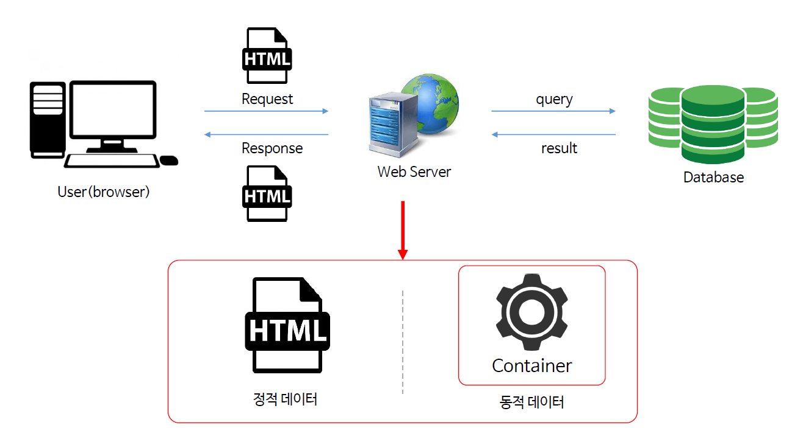

# JSP & Servlet OT 

1-1. 웹 프로그램이란?

컴퓨터가 서로 연결되어 있는것 =  네트워크가 연결되어 있다.

**사용자(브라우저) ->Request -> Web Server -> Response -> 사용자(브라우저)**

웹 프로그램이란, 인터넷 서비스를 이용해서 서로 다른 구성요소들(Pc등) 이 통신할 수 있는 프로그램이다.

1-2. 프로토콜과 IP

* 프로토콜

  **통신을 하기 위한 규약으로 HTTP, FTP, SMTP, POP등이 있다.**

  HTTP : 사용자가 어떠한 요청을 했을 때, 하이퍼텍스트를 이용해서 응답해주는 프로토콜

  FTP : 파일 전송 프로토콜

  SMTP, POP : 메일을 전송하는 데 사용하는 프로토콜

* IP 주소

  **인터넷 객체 - > DNS -> IP주소 -> WebServer의 여러 프로그램**

1-3. 웹 프로그램의 동작 원리

* 사용자가 요청했을 때,  요청을 한 데이터는 데이터 베이스에서 어떠한 데이터를 가져올 것인지 판단을 한다.
* 가져올 필요가 있을 때, 웹서버는 DB에 Query(질의)를 날려서 데이터를 받는다.
* 응답을 받은 웹 서버는 response해서 User에게 돌려준다.
* 웹 서버와 User가 통신할 때는 Html로 통신
* 사용자가 요청을 했을 때, 가공할 필요가 없는 데이터(정적 데이터)를 요청하면 HTML로 보여주면 된다. 그러나 요청한 데이터에 있어 따로 수집하고 가공하고 뭔가 변화를 줘야할 때(동적 데이터)에는 Web Container에서 데이터를 가공해서 새로운 데이터를 뽑아내고, 그것을 Html로 보여준다.

 
