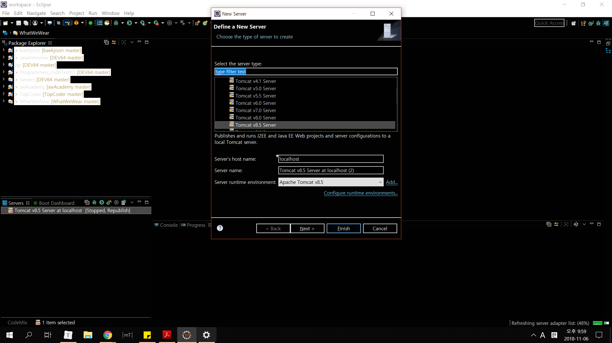
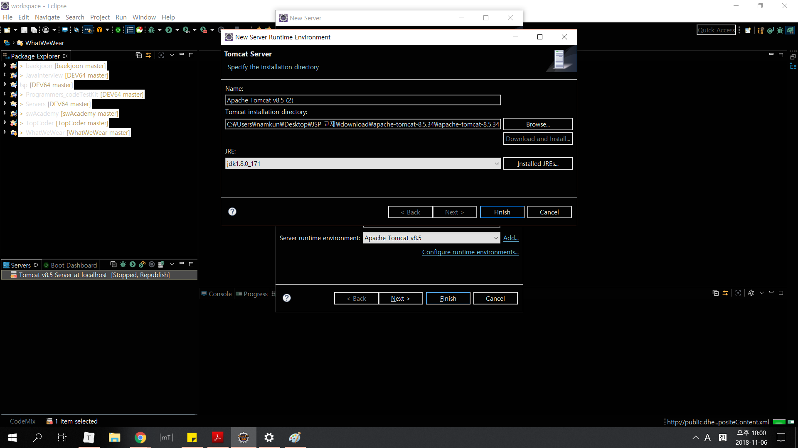
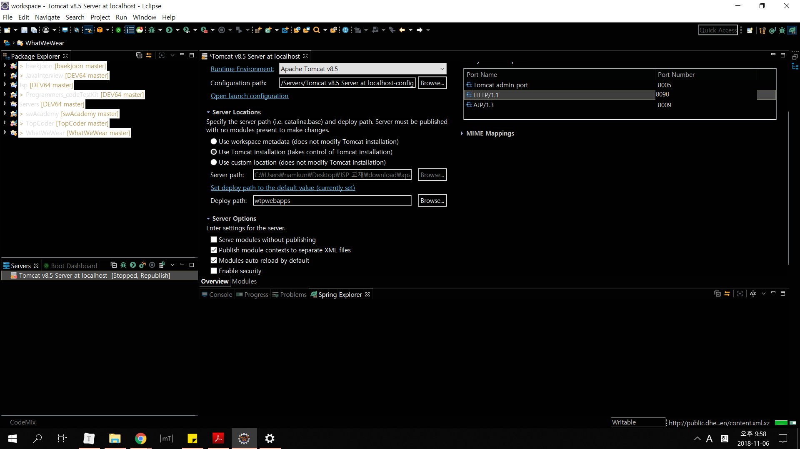
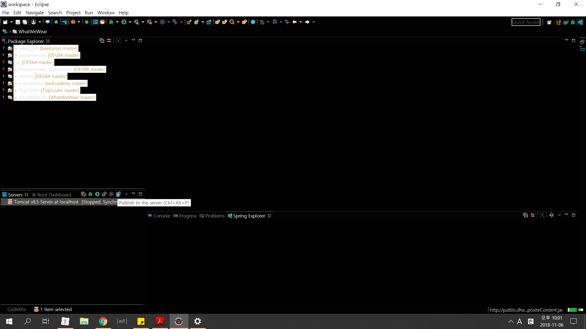
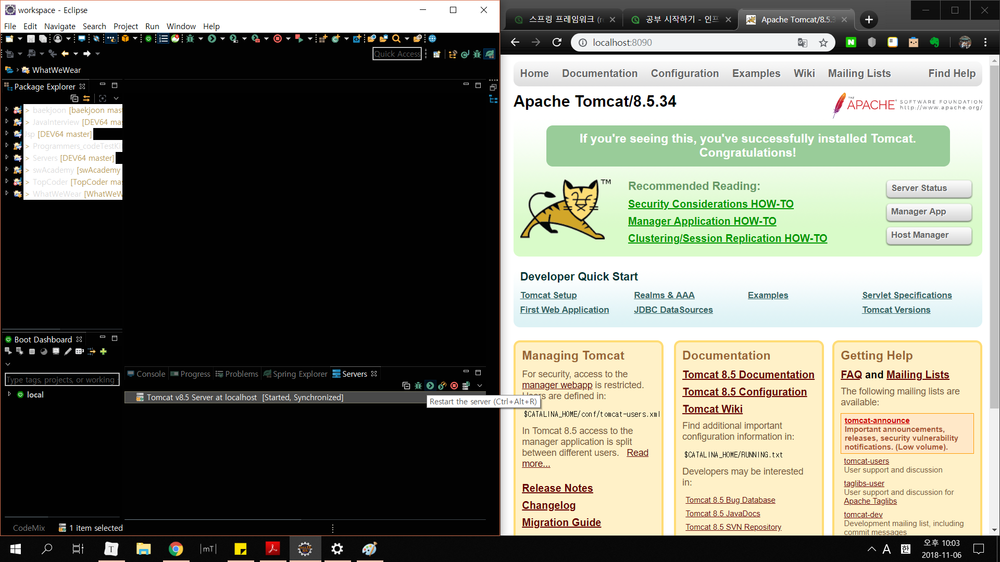

# JSP & Servlet 개발환경 설정

웹 컨테이너 설치 - Tomcat 8.5

tomcat.apache.org로 들어가서 tomcat 8.5를 다운받고, 압축을 풀어준다.

그 다음 다음과 같이 설정해준다.

1. Tomcat을 server에서 선택하고 추가해준다.

 

2. Tomcat의 파일 위치를 지정해주고 , JRE를 선택해준다.

3. 무사하게 추가되었다면, 다음과 같이 서버에서 설정을 해준다.

4. 그 뒤 서버를 동기화 시켜준다.

4. 서버를 시작하고, 잘 돌아가는지 확인하기위해 아까 지정한 HTTP/1.1의 Post Number가 붙은 localhost:8090으로 들어간다. 

