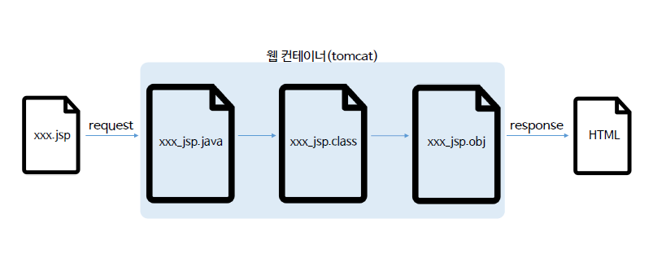
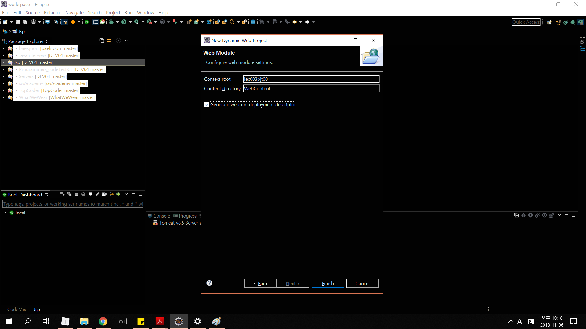
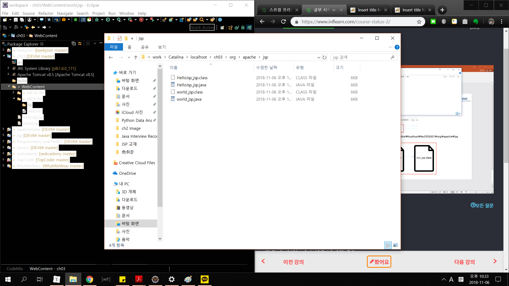

# Ch03 - JSP 맛보기

3-1. 웹 컨테이너 구조



* 개발자가 만든 xxx.jsp가 .java로 변환되고, 컴파일러를 통해 .class로 컴파일된다. 이 컴파일된 클래스 파일은 링크 작업을 하기 위해 오브젝트 파일로 만들어서, 자바 환경내에서 실행이 되고, 실행된 결과물이 사용자에게 응답이 될 때는 html로 보인다.
* WAS = Web Application Server 

3-2. JSP 파일 작성

new -> Dynamic Web Project



생성하고, 그 뒤, JSP파일을 다음과 같이 작성한다. (WebContent폴더 안에 만들어줘야한다.)

```jsp
<%@ page language="java" contentType="text/html; charset=EUC-KR"
	pageEncoding="EUC-KR"%> <!-- 페이지 지시어 : WebContainer한테 이 파일이 어떤 파일인지 알려주는 부분 -->
<!DOCTYPE>
<html>
		<head>
			<meta http-equiv="Content-Type" content="text/html; charset=EUC-KR">
		<title>Insert title here</title>
		</head>
	<body>
	
	<p> Hello JSP World </p>
	
	</body>
</html>
```

만든 뒤에, 이를 Run as -> Run on Server로 실행한다. 그럼 정상적으로 작동할 것.

이렇게 JSP를 만들고 나면 자동으로 이를 실행하기 위해서 웹 컨테이너가 .java, .class파일로 만드는데, 이 파일들은 해당 경로에 다음과 같이 저장되어 있다.


