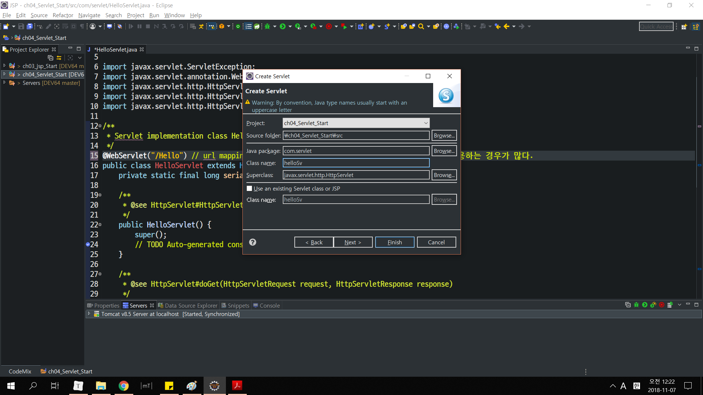

# ch04 - Servlet 맛보기

jsp와 servlet은 둘 다 사용자의 요청에 응답을 하기위한 웹 프로그램

jsp : 기존 html코드에 jsp 코드를 삽입해서 확장자를 .jsp로 만든 것.

servlet : 순수 자바파일만을 이용한다. jsp랑은 다름.

이렇게 만든 servlet과  jsp는 WebContent파일에서 .class로 컴파일되고 jsp와 마찬가지로 사용자에게 response된다.

Servlet을 만드는 것은 jsp와 동일하나, 한 군데 만 다르다.

우선 다음과 같이 package와 파일이름을 정해준다.



그 다음, servlet의 url을 mapping해준다.


그러면 다음과 같은 자바 서블릿 코드가 뜰 것. 그 사이에 우리가 출력하고 싶은 코드를 입력하자.

```java
package com.servlet;

import java.io.IOException;
import java.io.PrintWriter;

import javax.servlet.ServletException;
import javax.servlet.annotation.WebServlet;
import javax.servlet.http.HttpServlet;
import javax.servlet.http.HttpServletRequest;
import javax.servlet.http.HttpServletResponse;

/**
 * Servlet implementation class HelloServlet
 */
// url mapping. 보통 url mapping은 똑같이 사용하지않고 축약해서 사용하는 경우가 많다.
@WebServlet("/Hello") 
public class HelloServlet extends HttpServlet {
	private static final long serialVersionUID = 1L;
       
    /**
     * @see HttpServlet#HttpServlet()
     */
    public HelloServlet() {
        super();
        // TODO Auto-generated constructor stub
    }

	/**
	 * @see HttpServlet#doGet(HttpServletRequest request, HttpServletResponse response)
	 */
	protected void doGet(HttpServletRequest request, HttpServletResponse response) throws ServletException, IOException {
		
        // printWriter객체를 통해서 출력한다.
		PrintWriter out = response.getWriter();
		out.print("<html>");
		out.print("<head>");
		out.print("</head>");
		out.print("<body>");
		out.print("<p>Hello Servlet</p>");
		out.print("</body>");
		out.print("</html>");
		
		response.getWriter().append("Served at: ").append(request.getContextPath());
	}

	/**
	 * @see HttpServlet#doPost(HttpServletRequest request, HttpServletResponse response)
	 */
	protected void doPost(HttpServletRequest request, HttpServletResponse response) throws ServletException, IOException {
		// TODO Auto-generated method stub
		doGet(request, response);
	}

}
```

작성 후, Run as Server로 jsp와 똑같이 실행한다면 동일한 결과를 얻을 수 있다.

또한 Servlet파일이 .class파일로 컴파일 된 것도 똑같이 확인할 수 있다.
