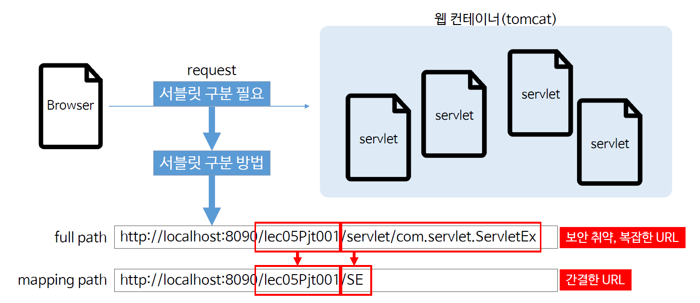
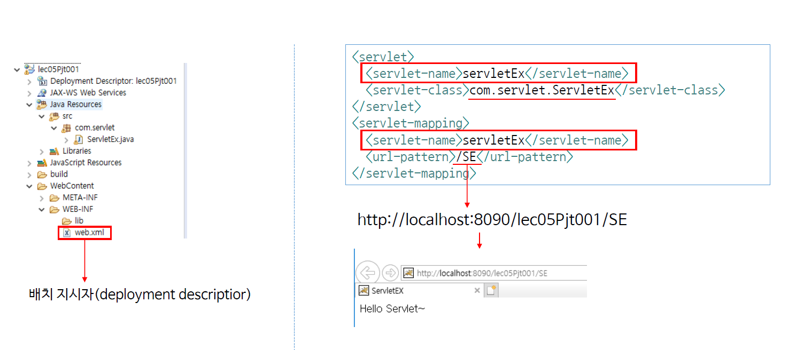
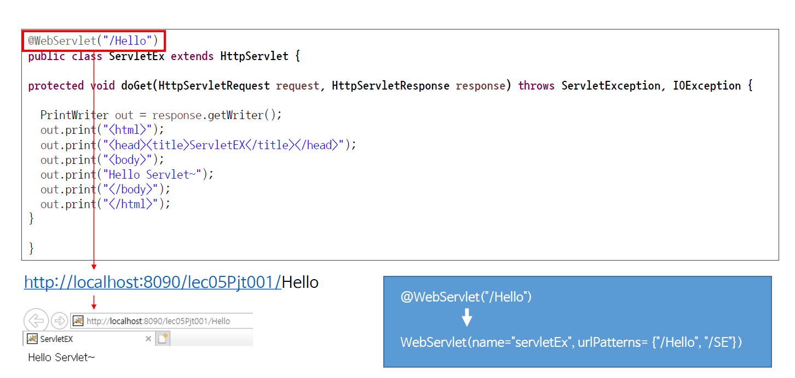

# Ch05 - Servlet mapping

### 가장 좋은 웹 프로그램 개발은 jsp와 servlet을 섞어서 만드는 것

* JSP로 만드는 부분은 주로 View.
* Servlet은 주로 Controller과 Model을 만든다.

### 서블릿 맵핑



* context Path까지는 쓰고, 그 이하로는 간단하게 URL로 나타낼 수 있는데, 이를 Servlet Mapping이라고 한다.

#### 서블릿 맵핑 방법

1. Web.xml을 통한 mapping

   

* 가장 고전적이나, 아직도 많은 사람이 선호한다.

*web.xml*

```xml
...
  <servlet> <!-- Servlet 등록 -->
  	<servlet-name>servletEx</servlet-name>
  	<servlet-class>com.servlet.servletEx</servlet-class>
  </servlet>
  <servlet-mapping> <!-- Servlet mapping 등록 -->
  	<servlet-name>servletEx</servlet-name>
  	<url-pattern>/SE</url-pattern>
  </servlet-mapping>
 ...
```


2. Java annotation을 이용한 mapping



```java
...
@WebServlet("/SE");
...
```

* 그러나 java annotation이 편하다고 해서 web.xml을 사용하는 방법을 모르면 안된다. 경우에 따라서 web.xml을 사용해야하는 경우가 있기 때문이다.
