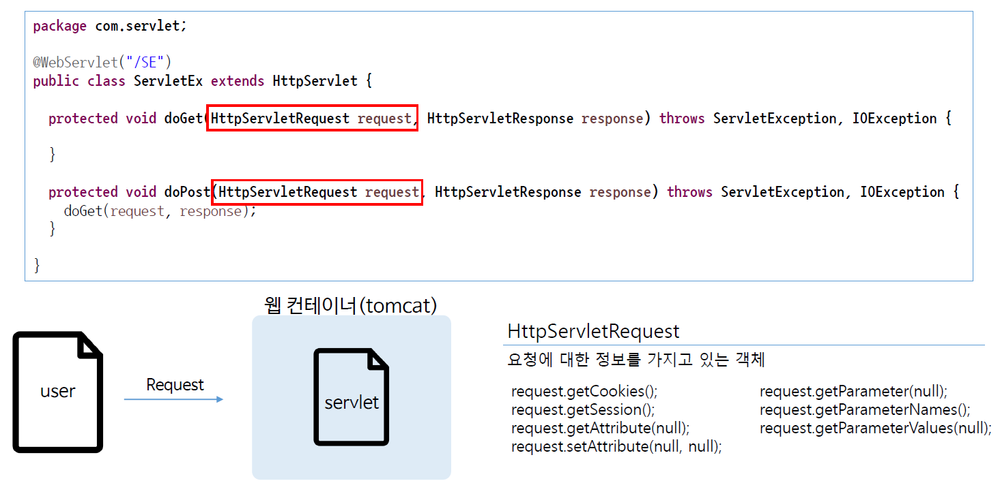

# Ch06 - Servlet request, response

#### 사용자의 요청과 web-Server의 응답(Response)을 담당하는 객체에 대해 학습해봅시다.

#### 1. HttpServlet


* `HttpServlet`은 추상클래스이다.
* .java 파일을 만들때, 이것을 servlet으로 만드려면, 반드시 `HttpServlet`를 상속받아서 만들어야함.
* 우리는 단지 `HttpServlet`만 상속받아서 사용만하면 그 위의 기능을 모두 사용할 수 있다. 

---

#### 2. HttpServlet Request & Response

*Request*



*Response*


*실제 코드*

```java
@WebServlet("/tsc")
public class TestServletClass extends HttpServlet {
	private static final long serialVersionUID = 1L;

    public TestServletClass() {
        super();
    }

	protected void doGet(HttpServletRequest request, HttpServletResponse response) throws ServletException, IOException {
		response.getWriter().append("Served at: ").append(request.getContextPath());
	}

	protected void doPost(HttpServletRequest request, HttpServletResponse response) throws ServletException, IOException {
		doGet(request, response);
	}

}
```

* `doGet`은 Get방식일때,  `doPost`는 Post방식일때 어떤것을 할 것인지 지정해주는 메서드
* `HttpServletRequest`, `HttpServletResponse`라고 써있는 것은 요청과 응답에 관련된 기능과 속성들을 갖고 있는 객체들이다.
* 어떤것을 요청받았는지 알고싶다면,  `request`로 시작하는 메서드를 사용하면되고, 반대로 어떤 것을 응답하는지 알고싶다면, `response`로 시작하는 메서드를 사용하면된다.
  * `request.getAttribute(null)`는 어떠한 속성의 값을 가져오는 메서드
  * `request.setAttribute(null)`는 어떤 속성의 값을 정해주는 메서드
  * `request.getParameter(null)`은 어떠한 양식에 대해서 값을 가져오는 메서드
  * `response.~~`은 서버가 브라우저에 뭔가 데이터를 알려줄 때, 그때 사용되는 객체이다.
