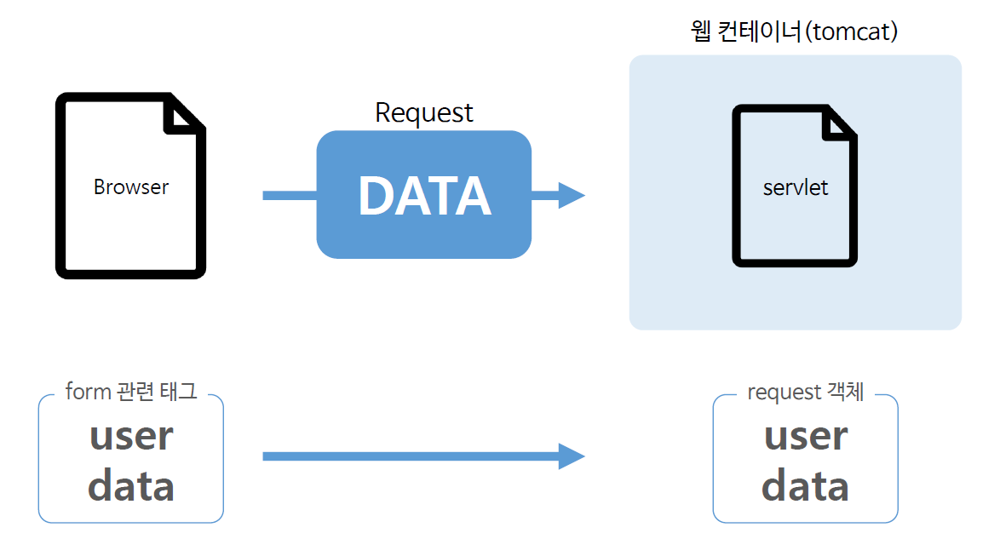
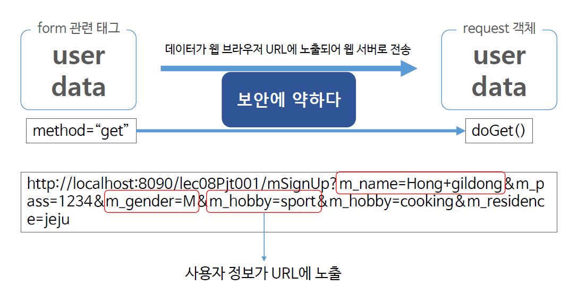
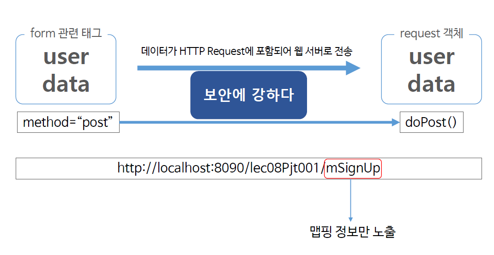

# Ch08_form데이터처리

1. form 태그

   

   * 사용자는 브라우저의 form tag를 이용해서 사용자의 정보를 서버에 전달하게 된다.
   * 사용자의 정보는 텍스트, 두개이상의 선택이 가능한 CheckBox, RadioButton등등 이런것들을 모두 form이라고 하며, data라고도 한다.

1. doGet

   

   * form에 전송되는 메서드 속성의 속성값이 Get방식이면 doGet으로 온다.
   * `m_name=Hong+gildong`, `m_gender=M`, `m_hobby = sport` 처럼 사용자의 정보가 url에 노출이 된다.
   * 나열될 수 있는 최대의 글자 수가 제한적일 수 있다.
   * 즉, 노출되면 안되는 정보들을 포함해야하는 페이지들은 Get방식을 사용하면 안된다.

2. doPost



* doGet방식과 다른 점은 `method = "post"`이고, doPost() 메서드가 호출된다. 	

* Post방식에서는 맵핑정보만 노출되고, 정보는 HTTP Request에 포함되어 웹 서버로 전송된다.

3. 실습

   *formEx.html*

   ```html
   <!DOCTYPE html>
   <html>
   <head>
   <meta charset="EUC-KR">
   <title>Insert title here</title>
   </head>
   <body>
   	<form action="mSignUp"method="post">
   		name : <input type="text" name="m_name"><br> 
           password :<input type="password" name="m_pass"><br> 
           gender : Man<input type="radio" name="m_gender" value="M" checked="checked">, Woman<input type="radio" name="m_gender" value="W"><br>
   		hobby : Sport<input type="checkbox" name="m_hobby" value="sport">,
   		Cooking<input type="checkbox" name="m_hobby" value="cooking">,
   		Reading<input type="checkbox" name="m_hobby" value="reading">,
   		Travel<input type="checkbox" name="m_hobby" value="travel"><br>
   		residence : <select name="m_residence">
   			<option value="seoul" selected="selected">Seoul</option>
   			<option value="gyeonggi">Gyeonggi</option>
   			<option value="chungcheong">Chungcheong</option>
   			<option value="jeonra">Jeonra</option>
   			<option value="jeju">Jeju</option>
   			<option value="gyeongsang">Gyeongsang</option>
   			<option value="gangwon">Gangwon</option>
   		</select><br> <input type="submit" value="sign up">
   	</form>
   </body>
   </html>
   ```

   * `<form action = 'mSignup' method = "post">`부분이 의미하는 것은, 아래 submit이 눌러지면, form안에 데이터들은 `mSignup`이라고 맵핑되어 있는 서블릿으로 간다는 의미이다.

   *MemSignUp.java*

   ```java
   package com.Servlet;
   
   import java.io.IOException;
   import java.util.Arrays;
   import java.util.Enumeration;
   
   import javax.servlet.ServletException;
   import javax.servlet.annotation.WebServlet;
   import javax.servlet.http.HttpServlet;
   import javax.servlet.http.HttpServletRequest;
   import javax.servlet.http.HttpServletResponse;
   
   @WebServlet("/mSignUp")
   public class MemSignUp extends HttpServlet {
   
   	protected void doGet(HttpServletRequest request, HttpServletResponse response) throws ServletException, IOException {
   		
   		System.out.println(" -- doGet() -- ");
   		
   		String m_name = request.getParameter("m_name");
   		String m_pass = request.getParameter("m_pass");
   		String m_gender = request.getParameter("m_gender");
   		String[] m_hobbys = request.getParameterValues("m_hobby");
   		String m_residence = request.getParameter("m_residence");
   		
   		System.out.println("m_name : " + m_name);
   		System.out.println("m_pass : " + m_pass);
   		System.out.println("m_gender : " + m_gender);
   		System.out.println("m_hobbys : " + Arrays.toString(m_hobbys));
   		System.out.println("m_residence : " + m_residence);
   		
   		Enumeration<String> names = request.getParameterNames();
   		while (names.hasMoreElements()) {
   			String name = (String) names.nextElement();
   			System.out.println("name : " + name);
   		}
   		
   	}
   
   	protected void doPost(HttpServletRequest request, HttpServletResponse response) throws ServletException, IOException {
   		
   		System.out.println(" -- doPost() -- ");
   		
   		doGet(request, response); // 정보를 갖고 다시 doGet으로 이동, 거기서 실행
   	}
   
   }
   
   ```

   * `String m_name = request.getParameter("m_name");`에서 m_name은 위의 html코드안에 form tag에 있는 `name : <input type="text" name="m_name">` 이 문장의 name = "m_name"을 통해 받아오는 것이다. 이렇게 이름을 같게 하여서 데이터가 제자리를 찾아갈 수 있도록 한다.
   * `String[] m_hobbys = request.getParameterValues("m_hobby");`는 여러개를 선택할 수 있는 값이기에 배열로 받는다. 
   * `request.getParameter(속성값)` - 속성에 사용자가 입력한 값을 가져올 수 있다.
   * `Enumeration<String> names = request.getParameterNames();` - 이 것을 통해서 여러개의 parameter name을 가져온다.