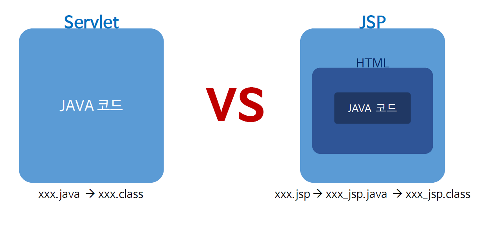

# Ch09_JspScript

1. Servlet vs JSP

   

* servlet은 순수 java코드로만 만들어져 있다.
* JSP는 html과 java코드가 섞여져 있다.

2. JSP 주요 스크립트


* jsp 파일을 실행하면, jsp 스크립트는 보이지 않는데, 그 이유는 jsp는 웹 컨테이너에서 동작을 하는 코드이기에, 동작할 때, java코드들은 웹 컨테이너안에서 모든 작동이 마친 상태이므로, 굳이 보여줄 필요가 없다.
* jsp 주석 태그도 java파일이 class파일이 될때 java코드와 함께 빠진다.


* include - 외부 파일을 가져올 때 사용.
* taglib - 외부 라이브러리 사용하는 방법

*jspEx.jsp*

```jsp
<%-- 지시어 --%>
<%@page import="java.util.ArrayList"%>
<%@page language="java" contentType="text/html;charset=EUC-KR"
	pageEncoding="EUC-KR"%>
<!DOCTYPE html>
<html>
<head>
<meta charset="EUC-KR">
<title>Insert title here</title>
</head>
<body>
	<%-- jsp 파일 가져오는 include --%>
	<%@ include file = "header.jsp" %>
	<!-- 선언 태그 -->
	<%!
	int num = 19;
	String str = "hi jsp";
	ArrayList<String> list = new ArrayList<>();
	
	public void jspMethod() {
		System.out.println("hi jsp");
	}%>
	<%-- 이것은 jsp 주석입니다. --%>
	<!-- 이것은 html 주석입니다. -->

	<!-- 스크립트릿 태그 -->
	<%
		if (num > 0) {
	%>
	<p>num > 0</p>
	<%
		} else {
	%>
	<p>num <= 0</p>
	<%
		}
	%>

	<!-- 표현식 태그 -->
	num is <%=num%>
	
	<%-- jsp 파일 가져오는 include --%>
	<%@ include file = "footer.jsp" %>
</body>
</html>
```

*header.jsp*

```jsp
<p>Header Contents</p>
```

*footer.jsp*

```jsp
<p> this is footer </p>
```

