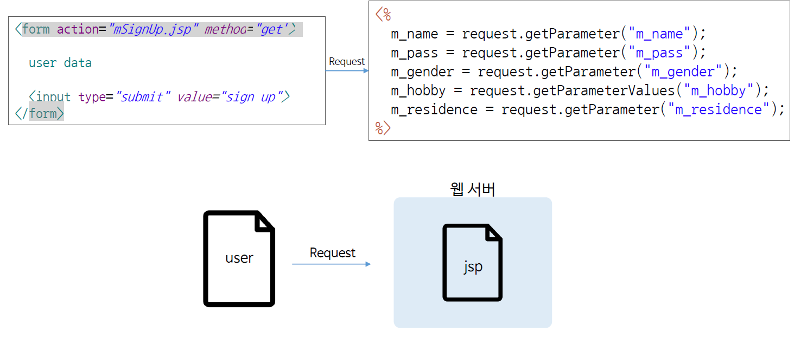
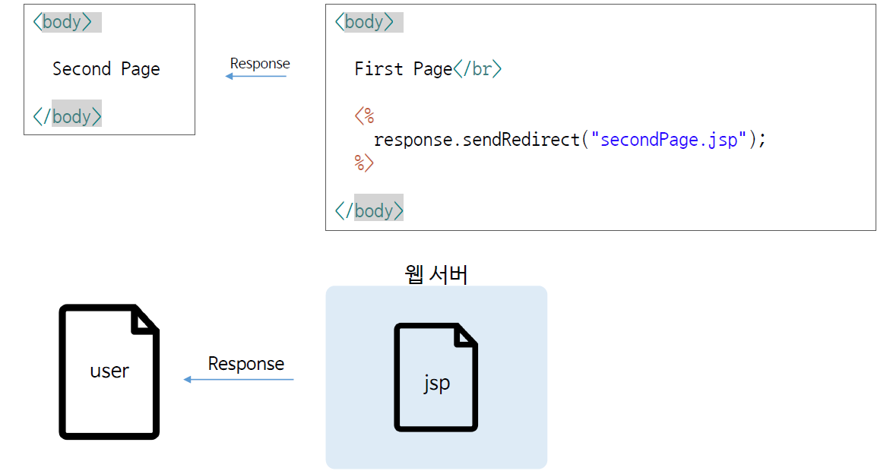

# Ch10_JSP_REQUEST_RESPONSE

1. Request



* name 속성에 있는 데이터를 요청해서 `.gerParameter`을 통해 받아온다.

*formEX.html*

```html
<!DOCTYPE html>
<html>
<head>
<meta charset="EUC-KR">
<title>Insert title here</title>
</head>
<body>
	<form action="mSignUp.jsp" method="get">
		name : <input type="text" name = "m_name"><br>
		password : <input type="password" name = "m_pass"><br>
		hobby : sport<input type="checkbox" name = "m_hobby" value = "sport"> 
				cooking<input type="checkbox" name = "m_hobby" value = "cooking"> 
				travel<input type="checkbox" name = "m_hobby" value = "travel"><br>
				<input type = "submit" value="sign up">
	
	</form>

</body>
</html>
```

*mSignUp.jsp*

```jsp
<%@page language="java" contentType="text/html; charset=EUC-KR" 
	pageEncoding="EUC-KR"%>
<!DOCTYPE html>
<html>
    <head>
        <meta charset="EUC-KR">
        <title>Insert title here</title>
    </head>
    <body>
    	<%!
    		String m_name;
    		String m_pass;
    		String[] m_hobby;
    	%>
    	
    	<%
    		m_name = request.getParameter("m_name");
    		m_pass = request.getParameter("m_pass");
    		m_hobby = request.getParameterValues("m_hobby");
    	%>
    	
    	m_name : <%= m_name %><br>
    	m_pass : <%= m_pass %><br>
    	m_hobby :
    	<%
    	 for(int i = 0; i< m_hobby.length; i++){
     	%>
     		<%= m_hobby[i] %>
     	<%
    	 }
     	%><br>
    </body>
</html>
```

위의 코드로 실행을 해보면 parameter값을 아주 잘 가져오는 것을 알 수 있다.

2. Response



* `.sendRedirect(@@@)`는 사용자에게 응답을 줄 때, 다른 곳으로 보내는 기능이다. 

* 실습해보자

*firstPage.jsp*

```jsp
<%@page language="java" contentType="text/html;charset=EUC-KR" pageEncoding="EUC-KR"%>
<!DOCTYPE html>
<html>
    <head>
        <meta charset="EUC-KR">
        <title>Insert title here</title>
    </head>
    <body>
    	<p>First page!!!</p>
    	
    	<%
    		response.sendRedirect("secondPage.jsp");
    	%>
    </body>
</html>
```

*secondPage.jsp*

```jsp
<%@page language="java" contentType="text/html;charset=EUC-KR" pageEncoding="EUC-KR"%>
<!DOCTYPE html>
<html>
    <head>
        <meta charset="EUC-KR">
        <title>Insert title here</title>
    </head>
    <body>
    	<p>Second page!!!</p>
    </body>
</html>
```

* 위에서 FirstPage를 실행하면 바로 SecondPage로 넘어가는 것을 볼 수 있다.