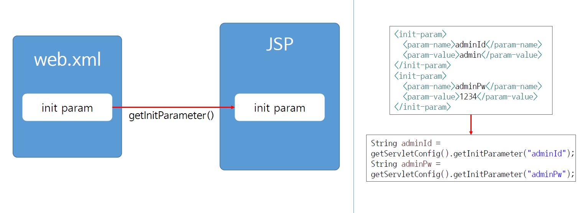
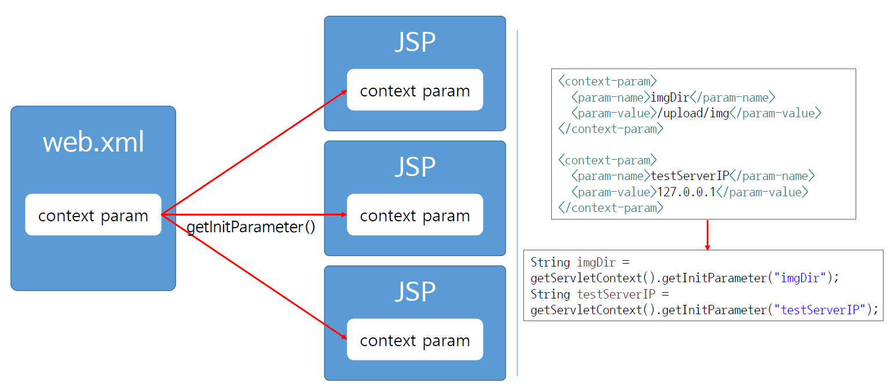
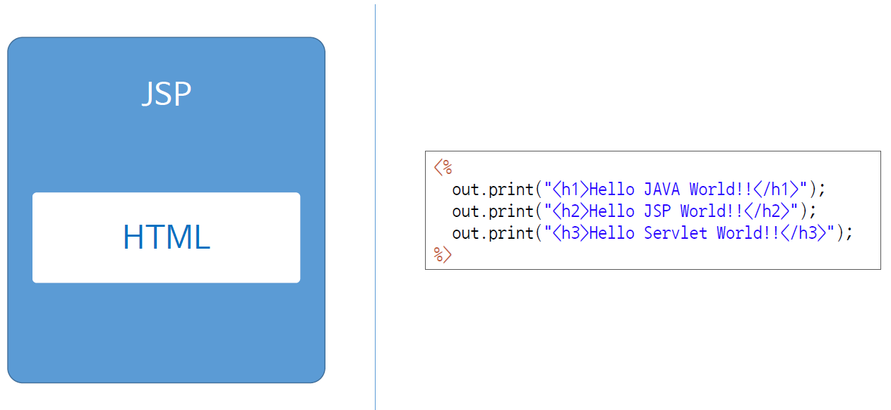
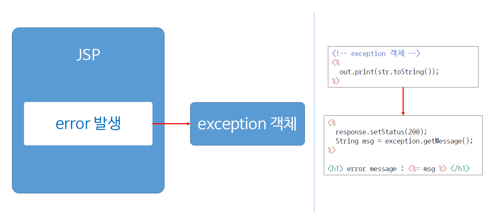

# Ch11_JSP내장객체

1. config 

   

   * web.xml에 데이터를 초기화 해놓고, 이를 jsp에서 갖다가 쓰는 것.
   * 지정된 서블릿에서반 데이터를 가져가서 사용할 수 있다.

   *코드 구현*

   *web.xml*

   ```xml
   <?xml version="1.0" encoding="UTF-8"?>
   <web-app xmlns:xsi="http://www.w3.org/2001/XMLSchema-instance"
   	xmlns="http://xmlns.jcp.org/xml/ns/javaee"
   	xsi:schemaLocation="http://xmlns.jcp.org/xml/ns/javaee http://xmlns.jcp.org/xml/ns/javaee/web-app_3_1.xsd"
   	id="WebApp_ID" version="3.1">
   	<display-name>ch11_jspInnerObj</display-name>
   	<welcome-file-list>
   		<welcome-file>index.html</welcome-file>
   		<welcome-file>index.htm</welcome-file>
   		<welcome-file>index.jsp</welcome-file>
   		<welcome-file>default.html</welcome-file>
   		<welcome-file>default.htm</welcome-file>
   		<welcome-file>default.jsp</welcome-file>
   	</welcome-file-list>
   
   	<servlet>
   		<servlet-name>servletEx</servlet-name>
   		<jsp-file>/jspEx.jsp</jsp-file>
   		<init-param>
   			<param-name>adminId</param-name>
   			<param-value>admin</param-value>
   		</init-param>
   		<init-param>
   			<param-name>adminPw</param-name>
   			<param-value>1234</param-value>
   		</init-param>
   
   	</servlet>
   	<servlet-mapping>
   		<servlet-name>servletEx</servlet-name>
   		<url-pattern>/jspEx.jsp</url-pattern>
   	</servlet-mapping>
   </web-app>
   ```

   *jspEx.jsp*

   ```jsp
   <%@ page language="java" contentType="text/html; charset=EUC-KR"
   	pageEncoding="EUC-KR"%>
   <!DOCTYPE>
   <html>
   <head>
   <meta charset=EUC-KR">
   <title>Insert title here</title>
   </head>
   <body>
   
   	<%!String adminId;
   	String adminPw;%>
   
   	<%
   		adminId = config.getInitParameter("adminId");
   		adminPw = config.getInitParameter("adminPw");
   	%>
   	
   	<p>adminId : <%= adminId %></p>
   	<p>adminPw : <%= adminPw %></p>
   	
   
   </body>
   </html>
   ```

2. application

   

   * config와 다르게 application 전체 어디서든 데이터를 가져다가 쓸 수 있게 해준다.

   *코드실습*

   *web.xml*

   ```xml
   ...
   <context-param>
   		<param-name>imgDir</param-name>
   		<param-value>/upload/img</param-value>
   	</context-param>
   	<context-param>
   		<param-name>testServer</param-name>
   		<param-value>127.0.0.1</param-value>
   	</context-param>
   	<context-param>
   		<param-name>realServer IP</param-name>
   		<param-value>68.0.30.1</param-value>
   	</context-param>
   ​```
   ```

   *jspEx.jsp*

   ```jsp
   ...
   <%
   	imgDir = application.getInitParameter("imgDir");
   	testServerIP = application.getInitParameter("testServer");
   	%>
   	
   		<p>imgDir : <%= imgDir %></p>
   	<p>testServerIP : <%= testServerIP %></p>
   ...
   ```

   * 추가로 `getAttribute()`, `setAttribute()`가 있는데 이것들은 말 그대로 값을 저장하고, 가져올 수 있는 메서드이다.
   * 아래의 코드를 통해 이해를 높이자.

   *jspEx.jsp*

   ```jsp
   ...
   	<%
   		application.setAttribute("connectedIP", "165.62.58.23");
   		application.setAttribute("connectedUser", "hong");
   	%>
   ...
   ```

   * 위의 코드를 통해서 값을 정해준다.

   *jspExGet.jsp*

   ```jsp
   <%@ page language="java" contentType="text/html; charset=EUC-KR"
       pageEncoding="EUC-KR"%>
   <!DOCTYPE>
   <html>
   <head>
   <meta charset=EUC-KR">
   <title>Insert title here</title>
   </head>
   <body>
   
   	<%! 
   		String connectedIP;
   		String connectedUser;
   	%>
   	
   	<!-- application 객체 -->
   	<%
   		connectedIP = (String) application.getAttribute("connectedIP");
   		connectedUser = (String) application.getAttribute("connectedUser");
   	%>
   	
   	connectedIP : <%= connectedIP %><br>
   	connectedUser : <%= connectedUser %>
   
   </body>
   </html>
   ```

   * 위의 코드를 실행하면, 제대로 지정해준 값을 가져오는 것을 알 수 있다.

3. out

   

   * 그대로 출력해주는 메서드 객체

4. exception

   

   * 에러가 발생했을 때, 발생하는 객체이다.
   * 실습에서는 일부러 초기화를 시키지않고 out.print로 하여 nullPointException이 나도록 하였다.

   *jspEx.jsp*

   ```jsp
   <%@ page language="java" contentType="text/html; charset=EUC-KR"
   	pageEncoding="EUC-KR"%>
   <%@ page errorPage = "errorPage.jsp" %><!-- 에러면 여기로 이동해준다 -->
   	...
   	<%!String adminId;
   	String adminPw;
   	
   	String imgDir;
   	String testServerIP;
   	
   	String str;
   	%>
   	...
   	<!-- exception 객체 -->
   	<%
   		out.print(str.toString()); // 초기화 선언하지 않고 str을 사용했기에, NullPointException이 발생한다.
   	%>
   
   </body>
   </html>
   ```

   *errorPage.jsp*

   ```jsp
   <%@ page language="java" contentType="text/html; charset=EUC-KR"
       pageEncoding="EUC-KR"%>
   <%@ page isErrorPage = "true" %><!-- 이거 에러페이지 맞습니다 -->
   <!DOCTYPE>
   <html>
   <head>
   <meta charset=EUC-KR">
   <title>Insert title here</title>
   </head>
   <body>
   	<%
   		response.setStatus(200);
   		String msg = exception.getMessage(); // 어떤 에러가 났는지 가져온다.
   	%>
   	
   	<h1> error msg : <%= msg %></h1>
   
   
   </body>
   </html>
   ```

   * 에러가 발생하면, errorPage로 이동해서 어떤 에러인지 보여줄 수 있도록 하였다.