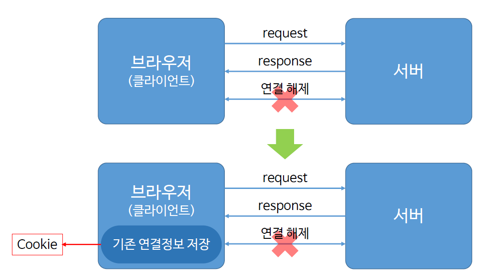
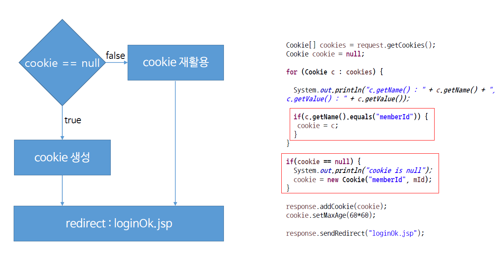

# Ch13_cookie

1. cookie란 무엇인가?

* 프로그램에서 흔적을 남긴다 = 쿠키
* 어떤 흔적? - 서버와 클라이언트가 연결했던 흔적



* HTTP의 특징 - 브라우저와 서버의 request, response가 한 차례 이뤄진 뒤, 연결을 바로 해제

* 왜그러냐? - 많은 클라이언트가 서버에 붙어있는데, 이 연결을 유지한다면 서버에 과부하가 오게되기 때문이다.(자원의 낭비)
* 쿠키는 서버와 클라이언트간의 연결을 더 빠르게 해주는 연결고리정도로 생각하면 된다. 
* 기존 연결정보를 클라이언트쪽에 저장하여, 재 연결할 때, 재사용하면된다.
* 단점은 보안에 취약하다. 쿠키가 클라이언트에 저장되었을 때, 이것이 유출될 가능성이 있기 때문이다.

2. cookie 구현



1. cookie가 먼저 null인지 확인
2. 있다면 cookie 재활용
3. null이라면 생성

### 실습 코드

*loginjsp.jsp*

```jsp
<%@ page language="java" contentType="text/html; charset=EUC-KR"
	pageEncoding="EUC-KR"%>
<!DOCTYPE>
<html>
<head>
<meta charset=EUC-KR">
<title>Insert title here</title>
</head>
<body>

	<!-- 쿠키가 있다면, 로그인 처리를 해준다. -->
	<%
		Cookie[] cookies = request.getCookies();
		System.out.println("cookies" + cookies); // log로 쿠키를 조회

		if (cookies != null) {
			for (Cookie c : cookies) {
				if (c.getName().equals("memberID")) {
					response.sendRedirect("loginOKjsp.jsp");
				}
			}
		}
	%>

	<form action="loginConfirm" method="post">
		ID : <input type="text" name="mID"><br> PW : <input
			type="password" name="mPW"><br> <input type="submit"
			value="login">

	</form>

</body>
</html>
```

*loginConfirm.java*

```java
package com.servlet;

import java.io.IOException;
import java.io.PrintWriter;

import javax.servlet.ServletException;
import javax.servlet.annotation.WebServlet;
import javax.servlet.http.Cookie;
import javax.servlet.http.HttpServlet;
import javax.servlet.http.HttpServletRequest;
import javax.servlet.http.HttpServletResponse;

@WebServlet("/loginConfirm")
public class loginConfirm extends HttpServlet {

	protected void doGet(HttpServletRequest request, HttpServletResponse response)
			throws ServletException, IOException {

		PrintWriter out = response.getWriter();

		String mID = request.getParameter("mID");
		String mPW = request.getParameter("mPW");

		out.print("mID : " + mID);
		out.print("mPW : " + mPW);

		Cookie[] cookies = request.getCookies();
		Cookie cookie = null;

		//cookie 조회
		for (Cookie c : cookies) {
			System.out.println("c.getName :" + c.getName() + " c.getValue() : " + c.getValue());
			
			// 기존에 memberID 조회한 이력이 있다면?
			if (c.getName().equals("memberID")) {
				cookie = c;
			}
		}
		
		// 없다면 사용자가 입력한 값으로~
		if (cookie == null) {
			System.out.println("cookie is null");
			cookie = new Cookie("memberID", mID);
		}
		
		response.addCookie(cookie);
		cookie.setMaxAge(60*60); // 1시간동안 유지

		response.sendRedirect("loginOKjsp.jsp");
	}

	protected void doPost(HttpServletRequest request, HttpServletResponse response)
			throws ServletException, IOException {
		doGet(request, response);
	}

}
```

*loginOKjsp.jsp* - 로그인이 완료된 화면

```jsp
<%@ page language="java" contentType="text/html; charset=EUC-KR"
	pageEncoding="EUC-KR"%>
<!DOCTYPE>
<html>
<head>
<meta charset=EUC-KR">
<title>Insert title here</title>
</head>
<body>

	<%
		Cookie[] cookies = request.getCookies();
		for (Cookie c : cookies) {
			out.print("name : " + c.getName() + "<br>");
			out.print("value : " + c.getValue() + "<br>");
			out.print("----------------------------------<br>");
		}
	%>

</body>
</html>
```

