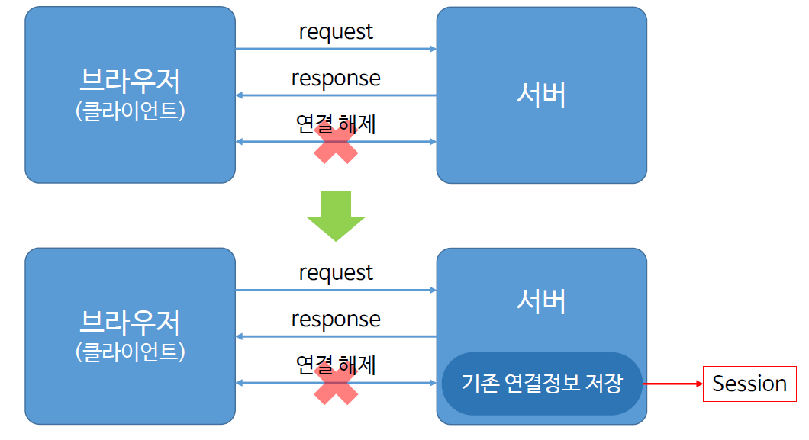
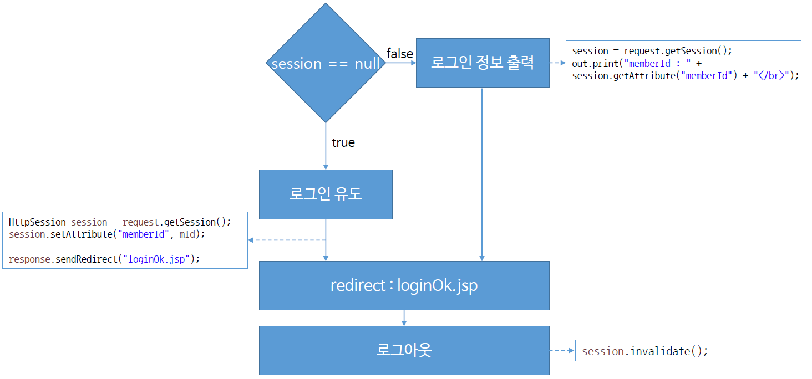

# Ch14_Session

### 1. Session 이란?



- Session은 cookie와 다르게 웹 컨테이너에서 생성이 되고 기존 연결정보를 서버에 저장하는 것이다.

### 2. Session의 구현



* session이 null인지 우선 확인
* null이면 로그인 유도
* 아니면 로그인 정보 출력

* 로그아웃을 하면 세션을 지운다.

### 3. 구현 코드

*login.jsp*

```jsp
<%@ page language="java" contentType="text/html; charset=EUC-KR"
    pageEncoding="EUC-KR"%>
<!DOCTYPE>
<html>
<head>
<meta charset=EUC-KR">
<title>Insert title here</title>
</head>
<body>

<!-- 세션의 유무 확인 -->
<%
	if(session.getAttribute("memberID") != null)
		response.sendRedirect("loginOK.jsp");
%>
<!-- 없다면 값을 입력받는다. -->
<form action="loginCon" method = "post">
	ID : <input type="text" name = "mID"><br>
	PW : <input type = "password" name ="mPW"><br>
	<input type = "submit" value = "login">
</form>
</body>
</html>
```

*LoginCon.java* - 로그인을 확인하는 servlet

```java
package com.servlet;

import java.io.IOException;
import javax.servlet.ServletException;
import javax.servlet.annotation.WebServlet;
import javax.servlet.http.HttpServlet;
import javax.servlet.http.HttpServletRequest;
import javax.servlet.http.HttpServletResponse;
import javax.servlet.http.HttpSession;

@WebServlet("/logoutCon")
public class LogoutCon extends HttpServlet {

	protected void doGet(HttpServletRequest request, HttpServletResponse response) throws ServletException, IOException {
		
		HttpSession session = request.getSession();
		session.invalidate();  // 세션 삭제
		
		response.sendRedirect("login.jsp");
	}

	protected void doPost(HttpServletRequest request, HttpServletResponse response) throws ServletException, IOException {
		doGet(request, response);
	}

}

```

*loginOK.jsp*

```jsp
<%@ page language="java" contentType="text/html; charset=EUC-KR"
    pageEncoding="EUC-KR"%>
<!DOCTYPE>
<html>
<head>
<meta charset=EUC-KR">
<title>Insert title here</title>
</head>
<body>
	<%
	session = request.getSession();
	out.print("memberID : " + session.getAttribute("memberID") + "<br>");
		
	%>
	
	<form action = "logoutCon" method = "post">
	
		<input type = "submit" value= "logout">
	</form>

</body>
</html>
```

