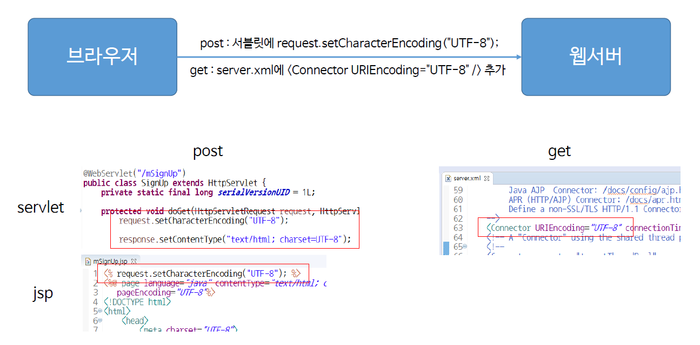
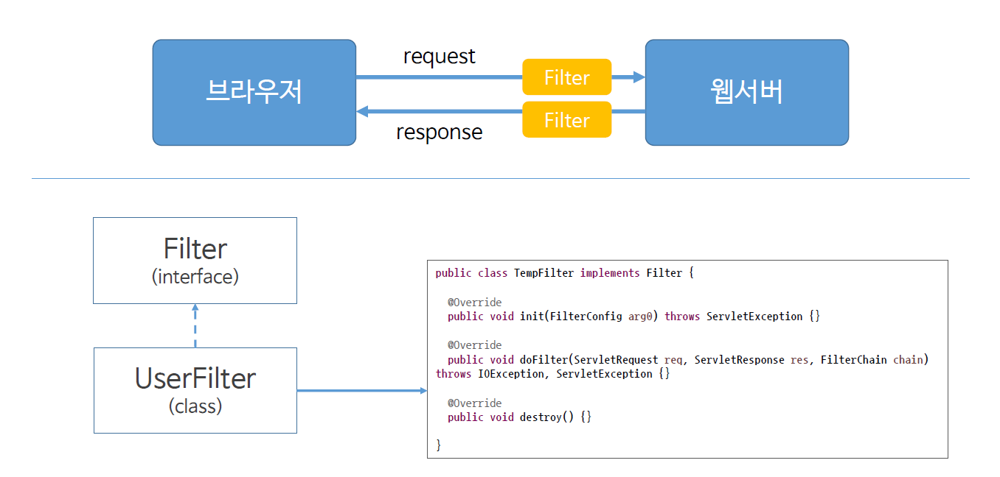

# ch15_한글처리

### 1. 한글처리



* post방식과 get방식이 다르니까 이를 유의하도록 하자.

* *formEx.jsp*

  ```jsp
  <%@ page language="java" contentType="text/html; charset=UTF-8"
  	pageEncoding="UTF-8"%>
  <!DOCTYPE>
  <html>
  <head>
  <meta charset="UTF-8">
  <title>Insert title here</title>
  </head>
  <body>
  	<!-- 서블릿으로 하는 방법 
  		<form action="mSignup" method = "post">
  		이름 : <input type="text" name = "m_name"><br>
  		별명 : <input type = "text" name = "m_nickname"><br>
  		<input type="submit" value = sign_up>
  	</form> -->
  	
  	<!-- jsp로 하는 방법 -->
  	<form action="mSignUp.jsp" method = "post">
  		이름 : <input type="text" name = "m_name"><br>
  		별명 : <input type = "text" name = "m_nickname"><br>
  		<input type="submit" value = sign_up>
  	</form>
  </body>
  </html>
  ```

* Post방식 + servlet

  *mSignup.java*

  ```java
  package com.servlet;
  
  import java.io.IOException;
  import java.io.PrintWriter;
  
  import javax.servlet.ServletException;
  import javax.servlet.annotation.WebServlet;
  import javax.servlet.http.HttpServlet;
  import javax.servlet.http.HttpServletRequest;
  import javax.servlet.http.HttpServletResponse;
  
  @WebServlet("/mSignUp")
  public class mSignup extends HttpServlet {
  
  	protected void doGet(HttpServletRequest request, HttpServletResponse response) throws ServletException, IOException {
  		
  		request.setCharacterEncoding("UTF-8");
  		
  		response.setContentType("text/html; charset = UTF-8");
  		
  		PrintWriter out = response.getWriter();
  		
  		String mName = request.getParameter("m_name");
  		String mNickName = request.getParameter("m_nickname");
  		
  		out.print("mName :" + mName + "<br>");
  		out.print("mNickName :" + mNickName);
  		
  	}
  
  	protected void doPost(HttpServletRequest request, HttpServletResponse response) throws ServletException, IOException {
  		doGet(request, response);
  	}
  
  }
  ```

* Post 방식 + jsp

  ```jsp
  <% request.setCharacterEncoding("UTF-8");%>
  <%@ page language="java" contentType="text/html; charset=UTF-8"
  	pageEncoding="UTF-8"%>
  <!DOCTYPE>
  <html>
  <head>
  <meta charset="UTF-8">
  <title>Insert title here</title>
  </head>
  <body>
  
  	<%!
  		String mName;
  		String mNickName;
  	%>
  
  	<%
  		mName = request.getParameter("m_name");
  		mNickName = request.getParameter("m_nickname");
  	%>
  
  	이름 :
  	<%=mName%>
  	<br> 
  	별명 :
  	<%=mNickName%>
  
  
  </body>
  </html>
  ```

### 2. Filter



한글처리를 조금 더 쉽게 하는 방법에는 Filter방식이 있다. 직접 Filter를 만들어서 request, response시에 모두 거치게 하는 것이다. 

*TempFilter.java*

```java
package com.servlet.filter;

import java.io.IOException;
import javax.servlet.Filter;
import javax.servlet.FilterChain;
import javax.servlet.FilterConfig;
import javax.servlet.ServletException;
import javax.servlet.ServletRequest;
import javax.servlet.ServletResponse;
import javax.servlet.annotation.WebFilter;

@WebFilter("/TempFilter")
public class TempFilter implements Filter {


	public void init(FilterConfig fConfig) throws ServletException {
		System.out.println("--- filter init() ---");
	}


	public void doFilter(ServletRequest request, ServletResponse response, FilterChain chain) throws IOException, ServletException {
		
		System.out.println("---- filter doFilter ----");
		
		// request filter
		request.setCharacterEncoding("UTF-8");
		
		chain.doFilter(request, response);
		
		// response filter
	
	}

	public void destroy() {
		System.out.println("--- filter destroy ---");
	}
}
```

* 이거 그냥 new할때 filter로 만들어주면 된다.(eclipse에서)