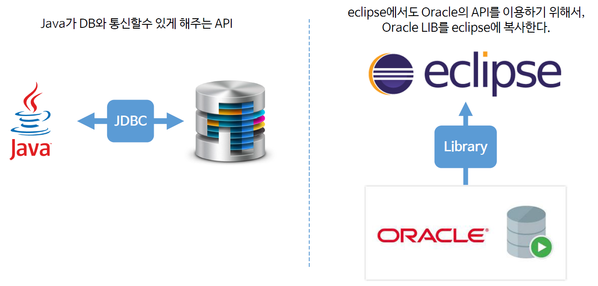
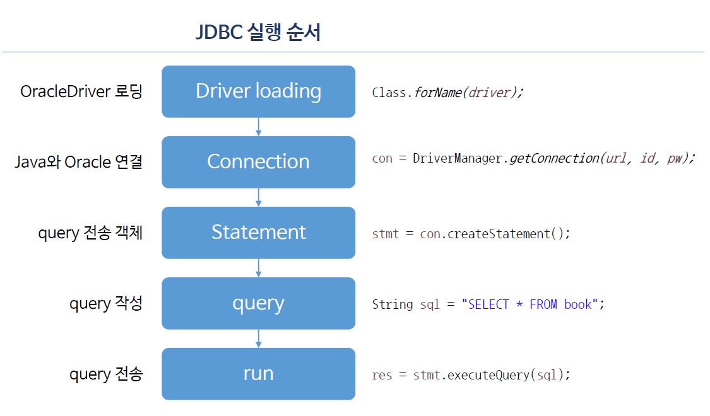
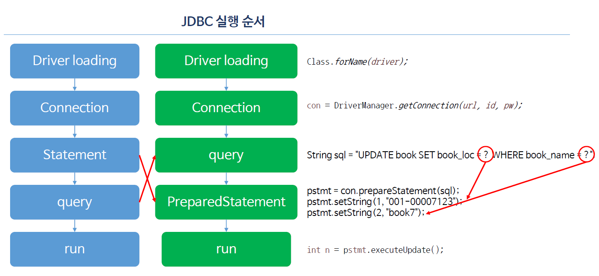

# Ch18_JDBC


1. JDBC 

   

   * JDBC는  JAVA와 DB와 통신할 수 있게 해주는 API의 묶음

2. JDBC를 이용한 데이터 관리

   

* 이를 이용해서 이전 SQL강의때 사용한 Book 테이블에 데이터를 삽입 및 검색해보자

  *newbook.jsp*

  ```jsp
  <%@ page language="java" contentType="text/html; charset=EUC-KR"
      pageEncoding="EUC-KR"%>
  <!DOCTYPE>
  <html>
  <head>
  <meta charset=EUC-KR">
  <title>Insert title here</title>
  </head>
  <body>
  	<form action="newBook" method ="post">
  		book name : <input type="text" name = "book_name"><br>
  		book location : <input type = "text" name = "book_loc"><br>
  		<input type = "submit" value = "book register">
  	</form>
  
  </body>
  </html>
  ```

  *NewBook.java*

  ```java
  package com.servlet;
  
  import java.io.IOException;
  import java.io.PrintWriter;
  import java.sql.Connection;
  import java.sql.DriverManager;
  import java.sql.Statement;
  
  import javax.servlet.ServletException;
  import javax.servlet.annotation.WebServlet;
  import javax.servlet.http.HttpServlet;
  import javax.servlet.http.HttpServletRequest;
  import javax.servlet.http.HttpServletResponse;
  
  @WebServlet("/newBook")
  public class NewBook extends HttpServlet {
  
  	protected void doGet(HttpServletRequest request, HttpServletResponse response)
  			throws ServletException, IOException {
  
  		response.setContentType("text/html; charset=UTF-8");
  		PrintWriter out = response.getWriter();
  
  		String bookName = request.getParameter("book_name");
  		String bookLoc = request.getParameter("book_loc");
  
  		String driver = "oracle.jdbc.driver.OracleDriver";
  		String url = "jdbc:oracle:thin:@localhost:1521:xe";
  		String id = "nam";
  		String pw = "***";
  
  		Connection con = null;
  		Statement stmt = null;
  
  		try {
  			Class.forName(driver);
  
  			con = DriverManager.getConnection(url, id, pw);
  			stmt = con.createStatement();
  			String sql = "INSERT INTO book(book_id, book_name, book_loc)";
  			sql += " VALUES (BOOK_SEQ.NEXTVAL, '" + bookName + "','" + bookLoc + "')";
  			int result = stmt.executeUpdate(sql);
  
  			if (result == 1) {
  				out.print("INSERT success!!");
  			} else {
  				out.print("INSERT fail");
  			}
  		} catch (Exception e) {
  			e.printStackTrace();
  		} finally { // resource를 해제하는 과정
  			try {
  				if (stmt != null)
  					stmt.close(); // statement 해제
  				if (con != null)
  					con.close(); // connection 해제
  			} catch (Exception e2) {
  				e2.printStackTrace();
  			}
  		}
  
  	}
  
  	protected void doPost(HttpServletRequest request, HttpServletResponse response)
  			throws ServletException, IOException {
  		doGet(request, response);
  	}
  
  }
  ```

  *bookservlet.java*

  ```java
  package com.servlet;
  
  import java.io.IOException;
  import java.io.PrintWriter;
  import java.sql.Connection;
  import java.sql.DriverManager;
  import java.sql.ResultSet;
  import java.sql.Statement;
  
  import javax.servlet.ServletException;
  import javax.servlet.annotation.WebServlet;
  import javax.servlet.http.HttpServlet;
  import javax.servlet.http.HttpServletRequest;
  import javax.servlet.http.HttpServletResponse;
  
  @WebServlet("/bs")
  public class bookServlet extends HttpServlet {
  
  	protected void doGet(HttpServletRequest request, HttpServletResponse response)
  			throws ServletException, IOException {
  
  		response.setContentType("text/html; charset=UTF-8");
  		PrintWriter out = response.getWriter();
  		String driver = "oracle.jdbc.driver.OracleDriver";
  		String url = "jdbc:oracle:thin:@localhost:1521:xe";
  		String id = "nam";
  		String pw = "***";
  
  		Connection con = null;
  		Statement stmt = null;
  		// 한번에 여러개의 데이터를 받아야하므로 ResultSet을 사용
  		ResultSet res = null;
  
  		try {
  			Class.forName(driver);
  
  			con = DriverManager.getConnection(url, id, pw);
  			stmt = con.createStatement();
  			String sql = "SELECT * FROM book";
  			// 검색할 때는 executeQuery
  			res = stmt.executeQuery(sql);
  			
  			while (res.next()) {
  				int bookId = res.getInt("book_id");
  				String bookName = res.getString("book_name");
  				String bookLoc = res.getString("book_loc");
  
  				out.println("bookId : " + bookId + ",");
  				out.println("bookName : " + bookName + ",");
  				out.println("bookLoc : " + bookLoc + "</br>");
  			}
  
  		} catch (Exception e) {
  			e.printStackTrace();
  		} finally { // resource를 해제하는 과정
  			try {
  				if (res != null)
  					res.close();
  				if (stmt != null)
  					stmt.close(); // statement 해제
  				if (con != null)
  					con.close(); // connection 해제
  			} catch (Exception e2) {
  				e2.printStackTrace();
  			}
  		}
  
  	}
  
  	protected void doPost(HttpServletRequest request, HttpServletResponse response)
  			throws ServletException, IOException {
  		doGet(request, response);
  	}
  
  }
  ```


3. PreparedStatement - query작성 코드가 지저분해지지 않도록!



* preparedStatement 객체로 조금 더 쉽게 query문을 작성하면 된다.

*modifyBook.java*

```java
package com.servlet;

import java.io.IOException;
import java.io.PrintWriter;
import java.sql.Connection;
import java.sql.DriverManager;
import java.sql.PreparedStatement;
import java.sql.Statement;

import javax.servlet.ServletException;
import javax.servlet.annotation.WebServlet;
import javax.servlet.http.HttpServlet;
import javax.servlet.http.HttpServletRequest;
import javax.servlet.http.HttpServletResponse;

@WebServlet("/modifyBook")
public class modifyBook extends HttpServlet {

	protected void doGet(HttpServletRequest request, HttpServletResponse response)
			throws ServletException, IOException {

		response.setContentType("text/html; charset=UTF-8");
		PrintWriter out = response.getWriter();

		String bookName = request.getParameter("book_name");
		String bookLoc = request.getParameter("book_loc");

		String driver = "oracle.jdbc.driver.OracleDriver";
		String url = "jdbc:oracle:thin:@localhost:1521:xe";
		String id = "nam";
		String pw = "***";

		Connection con = null;
		PreparedStatement pstmt = null;

		try {
			Class.forName(driver);

			con = DriverManager.getConnection(url, id, pw);
			String sql = "UPDATE book SET book_loc = ? WHERE book_name = ?";
			
            //?에 값을 집어넣기만 하면 된다.
			pstmt = con.prepareStatement(sql);
			pstmt.setString(1, "001-00007123");
			pstmt.setString(2, "book7");
			
			int result = pstmt.executeUpdate(sql);

			if (result == 1) {
				out.print("INSERT success!!");
			} else {
				out.print("INSERT fail");
			}
		} catch (Exception e) {
			e.printStackTrace();
		} finally { // resource를 해제하는 과정
			try {
				if (pstmt != null)
					pstmt.close(); // statement 해제
				if (con != null)
					con.close(); // connection 해제
			} catch (Exception e2) {
				e2.printStackTrace();
			}
		}

	}

	protected void doPost(HttpServletRequest request, HttpServletResponse response)
			throws ServletException, IOException {
		doGet(request, response);
	}
}
```

