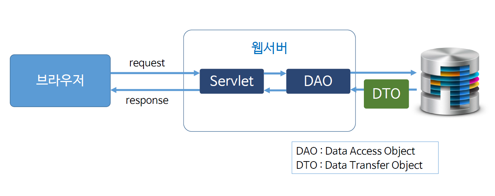
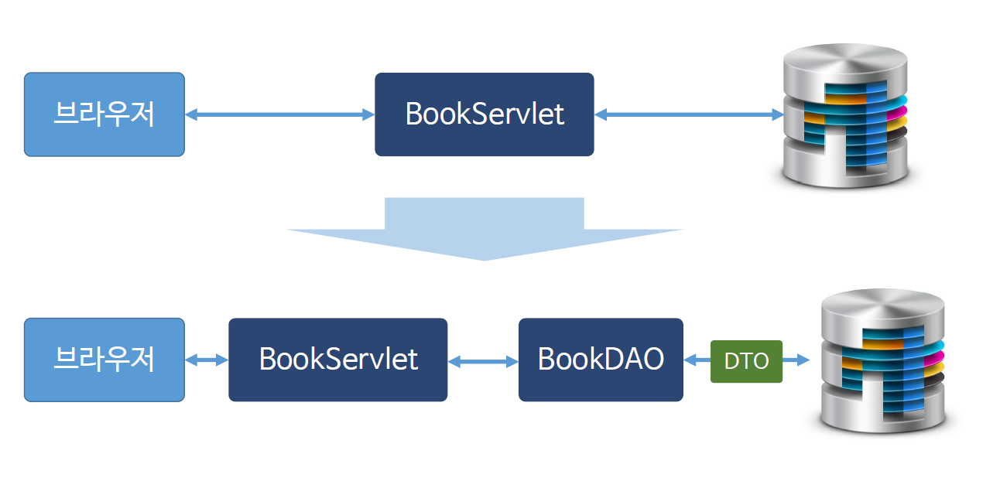

# Ch19_DAO_DTO

### 1. DAO, DTO란?



* DB에 접근하는 기능을 객체로 따로 빼놓은 것이 DAO. 즉, 웹서버에서 DB와 관련된 부분만 따로 떼어낸것 - DAO
* DB에 있는 Data의 형태를 Java에 맞는 자료형으로 가공해주는 중간매체 - DTO(or VO)

### 2. DAO, DTO 구현



* 기존의 `BookServlet`이 하던 일에서 DB Connection부분, Query부분을 가져가서 BookDao를 만들어준다. 
* 기존의 코드와 비교해보며 봐야만한다. 
* 아래 코드는 실습 코드이고 , 이를 보고 이해하자

*BookServlet.java*

```java
package com.servlet;

import java.io.IOException;
import java.io.PrintWriter;
import java.util.ArrayList;

import javax.servlet.ServletException;
import javax.servlet.annotation.WebServlet;
import javax.servlet.http.HttpServlet;
import javax.servlet.http.HttpServletRequest;
import javax.servlet.http.HttpServletResponse;

import com.servlet.dao.BookDAO;
import com.servlet.dto.BookDTO;

@WebServlet("/bs")
public class BookServlet extends HttpServlet {

	protected void doGet(HttpServletRequest request, HttpServletResponse response)
			throws ServletException, IOException {
		
		response.setContentType("text/html; charset = UTF-8");
		PrintWriter out = response.getWriter();
		
		BookDAO bookDAO = new BookDAO(); 
		ArrayList<BookDTO> list = bookDAO.select();
		
		for (int i = 0; i < list.size(); i++) {
			BookDTO dto = list.get(i);
			int bookId = dto.getBookId();
			String bookName = dto.getBookName();
			String bookLoc = dto.getBookLoc();
			
			out.println("bookId : " + bookId + ",");
			out.println("bookName : " + bookName + ",");
			out.println("bookLoc : " + bookLoc + "<br>");
			
		}
	}

	protected void doPost(HttpServletRequest request, HttpServletResponse response)
			throws ServletException, IOException {
		doGet(request, response);
	}

}
```

*BookDAO.java*

```java
package com.servlet.dao;

import java.sql.Connection;
import java.sql.DriverManager;
import java.sql.PreparedStatement;
import java.sql.ResultSet;
import java.util.ArrayList;

import com.servlet.dto.BookDTO;

public class BookDAO {
	String driver = "oracle.jdbc.driver.OracleDriver";
	String url = "jdbc:oracle:thin:@localhost:1521:xe";
	String id = "nam";
	String pw = "***";

	public BookDAO() {
		try {
			Class.forName(driver);
		} catch (Exception e) {
			e.printStackTrace();
		}
	}
	
	public ArrayList<BookDTO> select() {
		
		// 이 메서드에서 DB에 접근해서 Data를 가져온다.
		
		ArrayList<BookDTO> list = new ArrayList<>();
		
		Connection con = null;
		PreparedStatement pstmt = null;
		ResultSet res = null;
		
		try {
			con = DriverManager.getConnection(url, id, pw);
			String sql = "SELECT * FROM book";
			pstmt = con.prepareStatement(sql);
			res = pstmt.executeQuery();
			
			while(res.next()) {
				int bookId = res.getInt("book_id");
				String bookName = res.getString("book_name");
				String bookLoc = res.getString("book_loc");
				
				BookDTO bookDTO = new BookDTO(bookId, bookName, bookLoc);
				list.add(bookDTO);
			}
		} catch (Exception e) {
			e.printStackTrace();
		} finally {
			try {
				if(res != null) res.close();
				if(con != null) con.close();
				if(pstmt != null) pstmt.close();
			} catch (Exception e2) {
				e2.printStackTrace();
			}
		}
		
		//list를 돌려준다.
		return list;
	}
}
```

*BookDTO.java*

```java
package com.servlet.dto;

public class BookDTO {

	int bookId;
	String bookName;
	String bookLoc;
	
    // 생성자에서 받아서 바로바로 데이터 변환
	public BookDTO(int bookId, String bookName, String bookLoc) {
		this.bookId = bookId;
		this.bookLoc = bookLoc;
		this.bookName = bookName;
	}
	
	//setter은 생성자에서 이미 초기화를 해줬기때문에 필요없다.
	
	public int getBookId() {
		return bookId;
	}

	public String getBookName() {
		return bookName;
	}

	public String getBookLoc() {
		return bookLoc;
	}	
}
```

