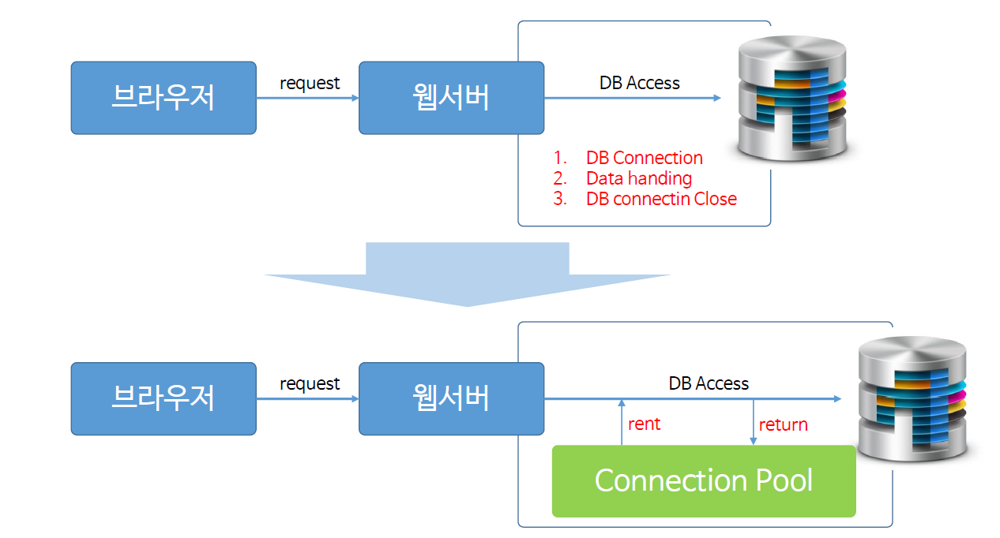
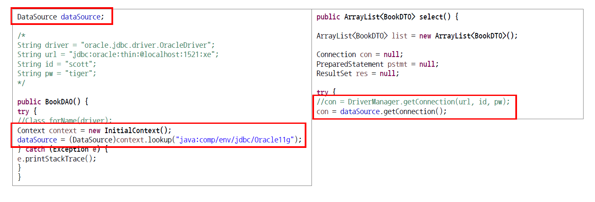

# Ch20_ConnectionPool

##### ConnectionPool은 데이터베이스와 작업을 할 때, 자원들을 조금 더 효율적으로 이용할 수 있는 방법이다.

1. ConnectionPool이란?

   

* DB와 연결하는 연결고리들이 Pool에 담겨있다는 의미.
* 기존의 상태에서 많은 커넥션을 할때마다 위의 1,2,3의 작업이 매우 많이 이루어져, 자원을 많이 사용하게된다. 그럴수록 프로세스에 부하가 걸리게 되고, 이는 통신속도에 과부하가 걸려서 속도가 떨어지거나 성능이 떨어지는 현상을 가져온다.
* 그래서 만든게 미리 만들어 두는 ConnectionPool!
* 미리 준비를 해두었기에 성능향상을 이뤄낼 수 있다!
* 서버가 한가할 때, Connection을 미리미리 만들어둬서, 필요할 때, rent하고 다 사용하면 return 해준다.
* 이러한 커넥션은 Web Container에 미리 만들어둔다.

2. Connection Pool 설정 - Tomcat Server파일내에 있는 context.xml 수정

   *context.xml*

   ```xml
   ...
   <!-- Connection Pool -->
   <Resource
       	auth="Container"  // ConnectionPool 명시
       	driverClassName="oracle.jdbc.driver.OracleDriver"    		     		 url="jdbc:oracle:thin:@localhost:1521:xe"
       	username="nam"
       	password="***"
       	name="jdbc/Oracle11g" // DB 이름 명시. 호출하기 위해서
       	type="javax.sql.DataSource" // Connection을 만들어 주는 객체, 즉 API
       	maxActive="4" // 4개를 만든다.근데 만약 4개가 다 사용되고 있다면
             			  // 자동적으로 1개가 더 만들어질 수 있다.
       	maxWait="10000" // 최대 이 정도 기다린다.(10초)
             /> 
   ...
   ```

   * 이렇게 만들어 두면 탐캣서버가 알아서 ConnectionPool을 만들어둔다.

3. ConnectionPool 구현

   

   * Java코드에서는 좀 더 간단해진다. 

   * 직접 DB에 Access하는 Connection 생성 코드가 필요없어지기 때문.

   * 대신 커넥션 풀을 가져오는 코드를 추가한다.(좌측 아래 빨간 네모)
   * 커넥션 풀을 사용했어도 자원사용한것은 똑같기에, 자원 반납은 해줘야한다.

   *bookDAO.java* - 코드 수정

   ```java
   package com.servlet.dao;
   
   import java.sql.Connection;
   import java.sql.DriverManager;
   import java.sql.PreparedStatement;
   import java.sql.ResultSet;
   import java.util.ArrayList;
   
   import javax.naming.Context;
   import javax.naming.InitialContext;
   import javax.sql.DataSource;
   
   import com.servlet.dto.BookDTO;
   
   public class BookDAO {
   	
   	DataSource dataSource;
   
   	public BookDAO() {
   		try {
   			// 컨테이너의 connection pool을 가져온다.
   			Context context = new InitialContext();
   			dataSource = (DataSource) context.lookup("java:comp/env/jdbc/Oracle11g");
   		} catch (Exception e) {
   			e.printStackTrace();
   		}
   	}
   	
   	public ArrayList<BookDTO> select() {
   		
   		// 이 메서드에서 DB에 접근해서 Data를 가져온다.
   		
   		ArrayList<BookDTO> list = new ArrayList<>();
   		
   		Connection con = null;
   		PreparedStatement pstmt = null;
   		ResultSet res = null;
   		
   		try {
   			con = dataSource.getConnection();
   			String sql = "SELECT * FROM book";
   			pstmt = con.prepareStatement(sql);
   			res = pstmt.executeQuery();
   			
   			while(res.next()) {
   				int bookId = res.getInt("book_id");
   				String bookName = res.getString("book_name");
   				String bookLoc = res.getString("book_loc");
   				
   				BookDTO bookDTO = new BookDTO(bookId, bookName, bookLoc);
   				list.add(bookDTO);
   			}
   		} catch (Exception e) {
   			e.printStackTrace();
   		} finally {
   			try {
   				if(res != null) res.close();
   				if(con != null) con.close();
   				if(pstmt != null) pstmt.close();
   			} catch (Exception e2) {
   				e2.printStackTrace();
   			}
   		}
   		
   		//list를 돌려준다.
   		return list;
   	}
   }
   
   ```
